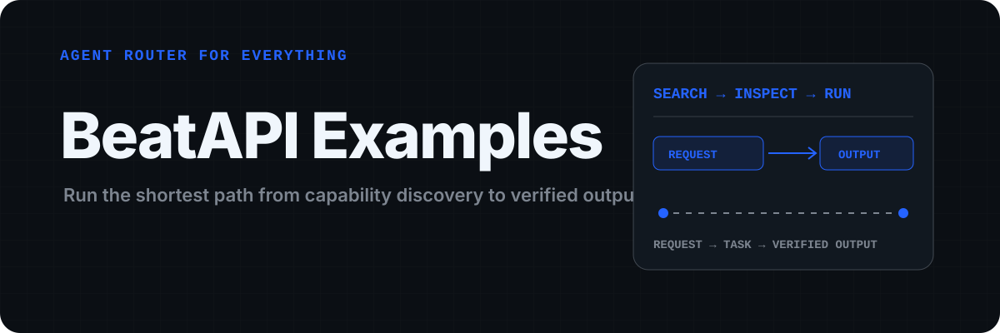
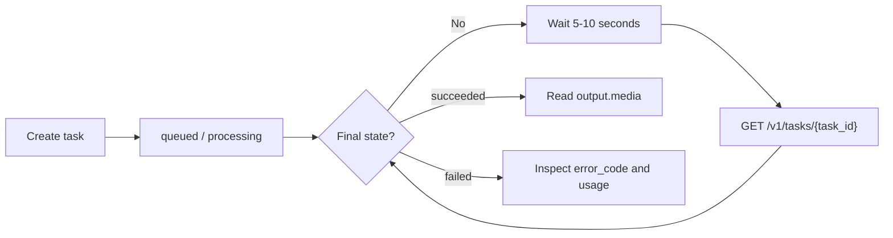

<p align="center">
  
</p>

<p align="center">
  <a href="https://beatapi.io/"><strong>Explore BeatAPI</strong></a> ·
  <a href="https://beatapi.io/dashboard/apikeys">Create an API key</a> ·
  <a href="https://docs.beatapi.io/">Docs</a> ·
  <a href="#quick-start-discover-a-live-capability">Quick start</a>
</p>

# BeatAPI Examples

BeatAPI is the **Agent Router for Everything**: one route to Model, Data, Tool,
and Workspace capabilities. This repository is the runnable proof layer—small
cURL, Node.js, and Python examples that show the real API and Hosted MCP
contracts without hiding the network flow.

[](https://github.com/BeatAPI/beatapi-examples/actions/workflows/verify.yml)

[Website](https://beatapi.io/) ·
[API documentation](https://docs.beatapi.io/) ·
[Agent setup](https://beatapi.io/SKILL.md) ·
[Realtime Video documentation](https://docs.beatapi.io/realtime-video) ·
[Music Video Playground](https://beatapi.io/music-video-api) ·
[Ecommerce Video Playground](https://beatapi.io/ecommerce-video-api)

The live catalog is discovered at runtime instead of copied into this
repository. As verified on 2026-09-22, it exposed 60 Model capabilities,
1,000+ Data actions, and three published Workflows. Those counts and IDs can
change independently of this repository, so integrations should always Search
and Inspect before execution.

## Quick start: discover a live capability

BeatAPI exposes a stable three-operation loop across its capability catalog:

```text
Search -> Inspect -> Run (or call the inspected direct API)
```

Run the read-only catalog walkthroughs:

```bash
bash examples/curl/capabilities.sh
node examples/node/capabilities.mjs
python3 examples/python/capabilities.py
```

Search and Inspect on `https://api.beatapi.io` are anonymous catalog
operations. Set `BEATAPI_API_KEY` to add a read-only connection check. Do not
start a paid operation until Inspect confirms the input, price, validation
state, and execution strategy.

For an Agent host, connect the Hosted MCP endpoint at
`https://beatapi.io/mcp` with a private Bearer API key. It exposes
`capabilities_search`, `capabilities_inspect`, and `capabilities_run`. See the
[Muse connector guide](integrations/muse/README.md) for the review-safe setup.

## Where this repository fits

```text
Agent or developer -> runnable example -> BeatAPI -> Model · Data · Tool · Workspace
```

- **Model** routes text, image, video, audio, and realtime model capabilities.
- **Data** currently includes the live Social Data catalog.
- **Tool** includes executable APIs, Effects, workflows, CLI, and MCP surfaces.
- **Workspace** is the shared project surface that Agents can operate through
  compatible integrations; availability depends on the selected integration.

## Workflow quickstart

The primary asynchronous workflow example remains
`POST /v1/music-video/tasks`.

```text
Create task -> queued/processing -> succeeded/failed -> hosted output
```



> This repository contains examples and a small reference client. It is not a
> versioned SDK and it does not contain the BeatAPI service implementation.

## Five-minute quickstart

Create an API key in the
[BeatAPI dashboard](https://beatapi.io/dashboard/apikeys), then export it:

```bash
export BEATAPI_API_KEY="sk_your_key"
```

Create a Music Video task:

```bash
curl https://api.beatapi.io/v1/music-video/tasks \
  -H "Authorization: Bearer $BEATAPI_API_KEY" \
  -H "Content-Type: application/json" \
  -d '{
    "images": ["https://media.beatapi.io/samples/neon-singer.png"],
    "audio_url": "https://media.beatapi.io/samples/neon-singer-preview.mp3",
    "prompt": "Neon rooftop performance with cinematic light trails.",
    "language": "en",
    "aspect_ratio": "9:16",
    "resolution": "720p",
    "compose_mode": "auto"
  }'
```

The response contains a task ID:

```json
{
  "data": {
    "id": "task_8K2qA",
    "status": "queued"
  }
}
```

Poll it every 5-10 seconds:

```bash
curl https://api.beatapi.io/v1/tasks/task_8K2qA \
  -H "Authorization: Bearer $BEATAPI_API_KEY"
```

Stop polling when the task is `succeeded` or `failed`. Successful output URLs
are available in `data.output.media`.

### Realtime session quickstart

Create Realtime sessions only from trusted server code. The browser must never
receive the permanent `sk_...` API key. It receives only the returned,
short-lived `client_secret`:

```bash
curl https://api.beatapi.io/v1/realtime/sessions \
  -X POST \
  -H "Authorization: Bearer $BEATAPI_API_KEY" \
  -H "Idempotency-Key: customer-call-123" \
  -H "Content-Type: application/json" \
  -d '{
    "max_duration_seconds": 60,
    "allowed_origins": ["https://app.example.com"]
  }'
```

Use `GET /v1/realtime/sessions/{session_id}` to inspect the session and
`DELETE` on the same path to close it idempotently. Camera capture and WebRTC
belong in the browser SDK; the server examples manage only session lifecycle.
Realtime production access and package availability remain limited until the
published launch checks are complete.

## Examples

Framework integrations: [Mastra](integrations/mastra/README.md) has a runnable
agent using an account-selected text model; [Pi](integrations/pi/README.md)
has a user-managed OpenAI Responses provider configuration.
The separately maintained [Pi BeatAPI Provider](https://github.com/BeatAPI/pi-beatapi-provider)
offers a GitHub-installable extension with a scoped three-model catalog.

| Example | cURL | Node.js | Python |
| --- | --- | --- | --- |
| Search and inspect capabilities | [`capabilities.sh`](examples/curl/capabilities.sh) | [`capabilities.mjs`](examples/node/capabilities.mjs) | [`capabilities.py`](examples/python/capabilities.py) |
| Music Video task | [`music-video.sh`](examples/curl/music-video.sh) | [`music-video.mjs`](examples/node/music-video.mjs) | [`music_video.py`](examples/python/music_video.py) |
| Ecommerce Video task | [`ecommerce-video.sh`](examples/curl/ecommerce-video.sh) | [`ecommerce-video.mjs`](examples/node/ecommerce-video.mjs) | [`ecommerce_video.py`](examples/python/ecommerce_video.py) |
| Poll a task | [`poll-task.sh`](examples/curl/poll-task.sh) | reference client | reference client |
| Upload a file | [`upload-file.sh`](examples/curl/upload-file.sh) | [`upload-file.mjs`](examples/node/upload-file.mjs) | [`upload_file.py`](examples/python/upload_file.py) |
| Receive webhooks | — | [`webhook-server.mjs`](examples/node/webhook-server.mjs) | — |
| Realtime session lifecycle | [`realtime-session.sh`](examples/curl/realtime-session.sh) | [`realtime-session.mjs`](examples/node/realtime-session.mjs) | [`realtime_session.py`](examples/python/realtime_session.py) |

The browser-side SDK handoff is shown in
[`examples/browser/realtime-video.ts`](examples/browser/realtime-video.ts).

### Node.js

The dependency-free examples require Node.js 20 or newer. Repository
verification requires Node.js 20.19+ or 22.12+.

```bash
node examples/node/music-video.mjs
node examples/node/ecommerce-video.mjs
node examples/node/realtime-session.mjs
```

The dependency-free reference client is at
[`examples/node/lib/beatapi.mjs`](examples/node/lib/beatapi.mjs). It shows
Bearer authentication, response-envelope handling, structured API errors,
bounded polling, and jitter.

### Python

Requires Python 3.11 or newer and uses only the standard library.

```bash
python3 examples/python/music_video.py
python3 examples/python/ecommerce_video.py
python3 examples/python/realtime_session.py
```

The matching reference client is at
[`examples/python/beatapi.py`](examples/python/beatapi.py).

## Public API

| Method | Endpoint | Purpose |
| --- | --- | --- |
| `POST` | `/v1/capabilities/search` | Discover current Model, Data, and Workflow capabilities |
| `POST` | `/v1/capabilities/inspect` | Read the selected capability contract, validation state, and execution route |
| `POST` | `/v1/capabilities/run` | Start a Run-capable contract or retrieve asynchronous status |
| `GET` | `/v1/models` | List the authenticated key's text models |
| `POST` | `/v1/responses` | Run a text model through the preferred compatibility interface |
| `GET` | `/v1/media/models` | List current image and video model contracts |
| `POST` | `/v1/images/tasks` | Create a model-specific image task |
| `POST` | `/v1/videos/tasks` | Create a model-specific video task |
| `GET/POST` | `/v1/effects` and `/v1/effects/tasks` | Discover and run published Effects |
| `POST` | `/v1/social-data/call` | Execute an inspected Social Data action |
| `GET` | `/v1/workflows` | List available workflows |
| `POST` | `/v1/music-video/tasks` | Create a Music Video task |
| `POST` | `/v1/ecommerce-video/tasks` | Create an Ecommerce Video task |
| `GET` | `/v1/tasks/{task_id}` | Poll task status and output |
| `GET` | `/v1/usage` | Read usage, credits, and concurrency |
| `POST` | `/v1/realtime/sessions` | Create a short-lived Realtime Video session |
| `GET/DELETE` | `/v1/realtime/sessions/{session_id}` | Inspect or close a Realtime Video session |
| `POST` | `/v1/files` | Upload local workflow inputs |
| `GET/POST` | `/v1/webhooks` | List or create webhook endpoints |
| `GET/PATCH/DELETE` | `/v1/webhooks/{id}` | Manage a webhook endpoint |

See the [OpenAPI 3.1 contract](openapi/beatapi.yaml) for complete request and
response schemas.

## Task lifecycle

The most common states are:

- `queued`: accepted and waiting for capacity;
- `processing`: generation is running;
- `storyboard_ready` / `requires_action`: a Music Video task needs shot
  selection;
- `editing` / `composing`: selected shots are being processed;
- `succeeded`: hosted output is ready;
- `failed`: no usable output was produced.

Polling is the simplest integration path. Use a 5-10 second interval with a
small amount of jitter and a bounded attempt count. Webhooks can reduce polling,
but `GET /v1/tasks/{task_id}` remains the source of truth.

## Error handling

BeatAPI uses real HTTP status codes and a stable public error envelope:

```json
{
  "error": {
    "code": "bad_request",
    "message": "The request body is invalid.",
    "request_id": "req_example_error"
  }
}
```

Log the `request_id` when asking for support. Retry network errors and selected
`5xx` responses with backoff. Do not blindly retry validation, authentication,
credit, or concurrency errors.

## Webhooks

Webhook requests include:

```text
X-BeatAPI-Event
X-BeatAPI-Signature
X-BeatAPI-Timestamp
```

Verify the signature against the exact raw request body before parsing JSON,
and reject timestamps older than five minutes. The Node.js receiver example
implements HMAC-SHA256 verification with a constant-time comparison.

The signed JSON body uses `event`, not `type`:

```json
{
  "id": "evt_example_123",
  "event": "task.succeeded",
  "created_at": 1784188934,
  "data": {
    "id": "task_8K2qA",
    "status": "succeeded"
  }
}
```

```bash
export BEATAPI_WEBHOOK_SECRET="whsec_your_secret"
node examples/node/webhook-server.mjs
```

## Integration guides

- [Muse Hosted MCP connector](integrations/muse/README.md)
- [n8n guide and importable bounded-polling workflow](integrations/n8n/README.md)
- [Postman](integrations/postman/README.md)
- [Sanitized response fixtures](fixtures/)
- [Production API reference](https://docs.beatapi.io/)

## API key safety

- Keep API keys on your server, worker, or automation platform.
- Never commit `.env` files or paste keys into browser code.
- Never include credentials in screenshots, exported workflow JSON, or issues.
- Rotate a key immediately if it is exposed.
- For Realtime, create sessions on the server and give the browser only the
  returned short-lived `client_secret`.
- Use exact HTTPS `allowed_origins`; wildcards are rejected.

## Repository scope

This repository intentionally contains only developer-facing examples and the
reviewed public contract. The hosted BeatAPI service, dashboard, billing,
workflow orchestration, and operational infrastructure are maintained
privately.

## Development

Tests use fake transports and fixtures. They do not call production or consume
credits.

```bash
npm test
npm run test:python
npm run verify
```

The public OpenAPI file is synchronized byte-for-byte from the private service
repository:

```bash
npm run sync:openapi
npm run check:openapi-sync
```

Run a read-only production smoke test with:

```bash
npm run smoke:live
```

Without `BEATAPI_API_KEY`, it checks anonymous workflow discovery. When the
environment variable is present, it additionally verifies authenticated
`GET /v1/usage`. The smoke test never creates tasks or consumes credits.

## License

Original example code in this repository is available under the
[MIT License](LICENSE). Use of the hosted BeatAPI service is governed by the
[BeatAPI Terms of Service](https://beatapi.io/terms-of-service).

<p align="center">
  Built by <a href="https://beatapi.io/"><strong>BeatAPI</strong></a> — Agent Router for Everything.
</p>
